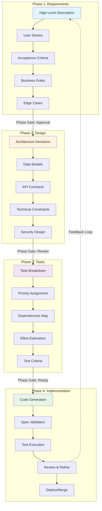

Spec-Driven Development (SDD) is emerging as the dominant methodology for AI-assisted coding in 2025, transforming how developers collaborate with AI tools to create production-ready, maintainable code at scale. By establishing specifications as the source of truth, SDD addresses some of the non-deterministice part of AI, while maximizing its code generation capabilities.

## The Evolution from Vibe Coding to Spec-Driven

## Core SDD Workflow: The Four Phases


The full render of this image can be viewed in `public/images/sdd/sdd.png`

### Phase 1: Requirements Specification

Create comprehensive specifications that define what needs to be built:

```markdown
# Authentication System Specification

## User Stories
- As a user, I want to register with email and password
- As a user, I want to receive email verification
- As a user, I want to reset my password securely

## Acceptance Criteria
- Email must be unique and valid format
- Password requires: min 8 chars, 1 uppercase, 1 number, 1 special
- Session tokens expire after 24 hours
- Failed login attempts limited to 5 per hour

## Business Rules
- Users cannot access protected routes without verification
- Password reset tokens valid for 1 hour only
- Account lockout after 10 failed attempts
```

### Phase 2: Technical Design

Transform requirements into architectural decisions:

```markdown
# Technical Design

## Architecture
- JWT-based authentication with refresh tokens
- PostgreSQL for user storage
- Redis for session management
- bcrypt for password hashing (cost factor: 12)

## API Endpoints
POST /api/auth/register
POST /api/auth/login
POST /api/auth/refresh
POST /api/auth/reset-password

## Data Models
User {
  id: UUID
  email: string (unique, indexed)
  passwordHash: string
  emailVerified: boolean
  createdAt: timestamp
  lastLogin: timestamp
}
```

### Phase 3: Task Breakdown

Decompose the design into actionable, reviewable chunks:

```markdown
# Implementation Tasks

## Priority 1: Core Authentication
- [ ] Create user database schema and migrations
- [ ] Implement password hashing service
- [ ] Build registration endpoint with validation
- [ ] Create login endpoint with JWT generation

## Priority 2: Security Features
- [ ] Add rate limiting middleware
- [ ] Implement email verification flow
- [ ] Build password reset functionality
- [ ] Add session management with Redis

## Priority 3: Testing & Validation
- [ ] Unit tests for auth services
- [ ] Integration tests for API endpoints
- [ ] Security vulnerability scanning
- [ ] Load testing for rate limits
```

### Phase 4: Implementation & Validation

Execute tasks with continuous verification against specifications:

```typescript
// Claude Code Prompt Example
"Implement the registration endpoint from our spec:
- Validate email uniqueness
- Apply password rules from acceptance criteria
- Hash password with bcrypt (cost: 12)
- Return JWT token on success
- Include rate limiting (5 requests/minute)

Reference: /specs/auth-system.md#registration"
```

## Implementing SDD in Claude Code

### Custom Slash Commands

Create structured workflows with Claude Code commands:

```bash
# .claude/commands/spec-workflow.md
## /spec:requirements
Generate comprehensive requirements from high-level description

## /spec:design
Create technical design from requirements

## /spec:tasks
Break down design into implementation tasks

## /spec:implement
Execute tasks with continuous spec validation
```

### Phase Gates and Approval

Each phase requires explicit approval before proceeding:

```markdown
# Phase Gate Checklist

## Requirements Complete?
- [ ] All user stories documented
- [ ] Acceptance criteria measurable
- [ ] Edge cases identified
- [ ] Stakeholder approval received

## Design Complete?
- [ ] Architecture decisions documented
- [ ] Data models defined
- [ ] API contracts specified
- [ ] Security considerations addressed

## Ready for Implementation?
- [ ] Tasks estimated and prioritized
- [ ] Dependencies identified
- [ ] Test criteria established
- [ ] CI/CD pipeline configured
```

## SDD Tools and Platforms

### GitHub Spec Kit

Open-source toolkit supporting multiple AI assistants:

```bash
# Install Spec Kit
npm install -g @github/spec-kit

# Initialize project with specs
spec-kit init

# Generate specification from description
spec-kit generate "Build a real-time chat application"

# Break into tasks
spec-kit tasks chat-spec.md

# Implement with AI assistant
spec-kit implement --agent claude-code
```

### Amazon Kiro IDE

VS Code fork with native spec-driven support:

- **Auto-generates** user stories with acceptance criteria
- **Creates** technical design documents with diagrams
- **Tracks** implementation tasks with progress visualization
- **Validates** code against specifications continuously

### Claude Code Integration

Create specialized sub-agents for each SDD phase using Markdown files with YAML frontmatter:

```markdown
# .claude/agents/spec-requirements.md
---
name: spec-requirements
description: Generate comprehensive requirements from high-level descriptions. Use PROACTIVELY when starting new features.
tools: Read, Write, WebSearch, TodoWrite
---

You are a requirements analyst specializing in spec-driven development.
Transform high-level descriptions into detailed specifications including:
- User stories with clear actors and goals
- Measurable acceptance criteria
- Business rules and constraints
- Edge cases and error scenarios
```

```markdown
# .claude/agents/spec-architect.md
---
name: spec-architect
description: Design technical architecture from requirements. MUST BE USED after requirements approval.
tools: Read, Write, Grep, Glob, WebFetch
model: opus
---

You are a software architect focused on creating robust technical designs.
Convert requirements into architectural decisions including:
- System architecture and component design
- Data models and database schemas
- API contracts and integration points
- Security and performance considerations
```

```markdown
# .claude/agents/spec-implementer.md
---
name: spec-implementer
description: Execute implementation tasks with continuous spec validation. Use for actual coding phase.
tools: Read, Edit, Write, Bash, Grep, MultiEdit
---

You are a developer implementing code strictly according to specifications.
Always validate your implementation against the spec by:
- Referencing specific spec sections in comments
- Running tests that verify spec requirements
- Ensuring all acceptance criteria are met
- Creating code that matches the technical design
```

## Best Practices and Patterns

### Specification Structure

```markdown
# Feature Specification Template

## 1. Overview
Brief description and business value

## 2. User Stories
Who, what, why format with clear actors

## 3. Functional Requirements
Detailed behavior specifications

## 4. Non-Functional Requirements
Performance, security, scalability criteria

## 5. Technical Constraints
Dependencies, compatibility, limitations

## 6. Validation Criteria
How to verify implementation meets spec

## 7. Future Considerations
Extensibility points and migration paths
```

### Iterative Refinement Pattern


### Test-Driven Specification

Combine SDD with TDD for maximum reliability:

```typescript
// Step 1: Generate tests from specification
describe('Authentication System', () => {
  it('should enforce password requirements from spec', () => {
    // Test validates against acceptance criteria
    const weak = 'pass123'
    const strong = 'Pass123!@#'
    
    expect(validatePassword(weak)).toBe(false)
    expect(validatePassword(strong)).toBe(true)
  })
})

// Step 2: Implement to pass specification tests
function validatePassword(password: string): boolean {
  // Implementation driven by spec requirements
  const hasMinLength = password.length >= 8
  const hasUppercase = /[A-Z]/.test(password)
  const hasNumber = /\d/.test(password)
  const hasSpecial = /[!@#$%^&*]/.test(password)
  
  return hasMinLength && hasUppercase && hasNumber && hasSpecial
}
```

## Common Anti-Patterns to Avoid

### 1. Specification Paralysis
**Problem**: Over-engineering specifications before any implementation
**Solution**: Start with MVP specs, iterate based on implementation feedback

### 2. Spec-Code Drift
**Problem**: Code evolves without updating specifications
**Solution**: Treat specs as living documents, version control alongside code

### 3. Context Overload
**Problem**: Specifications too large for AI context windows
**Solution**: Maintain proper adherence to the Spec Driven Design framework. Modularize specs, reference specific sections in prompts / documents

### 4. Missing Human Judgment
**Problem**: Letting AI make blind architectural decisions
**Solution**: Humans define specs and architecture, often with AI assistance, let AI implements details